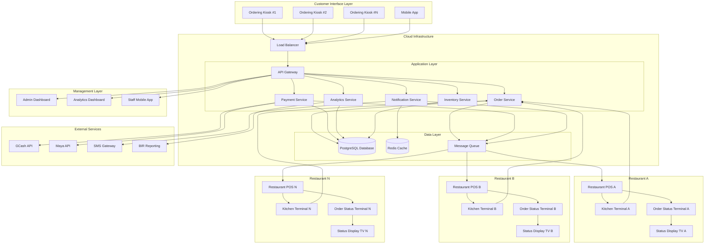
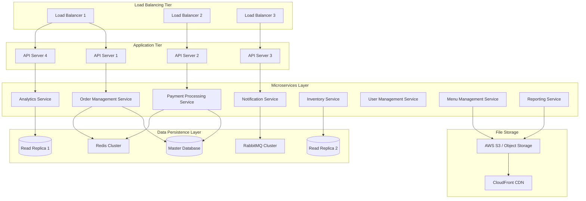
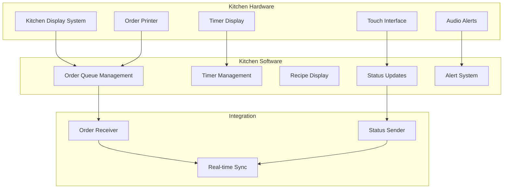
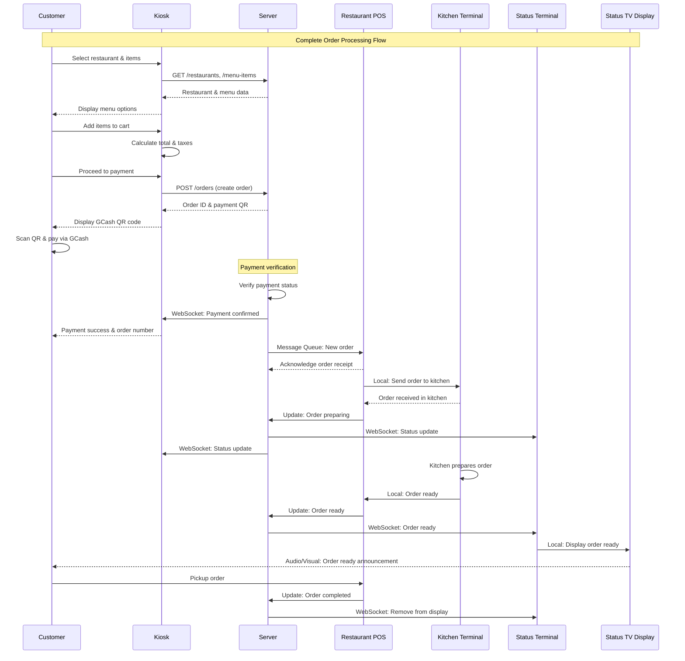
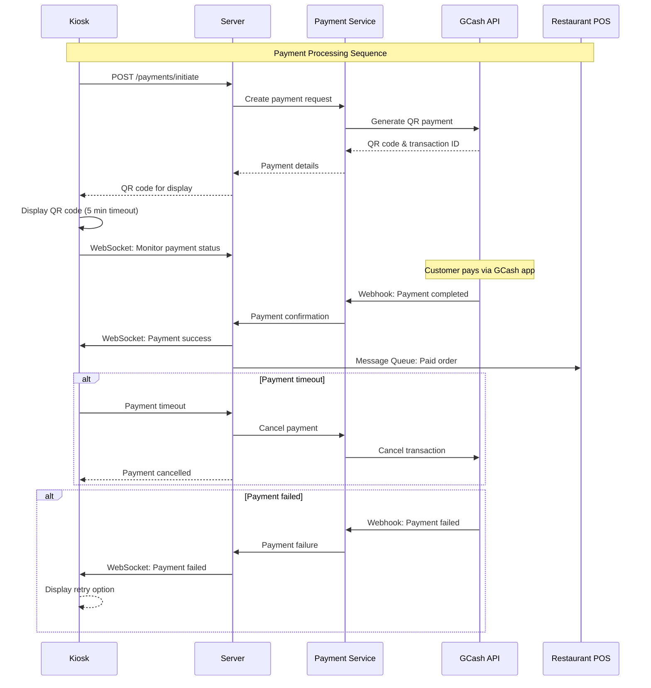
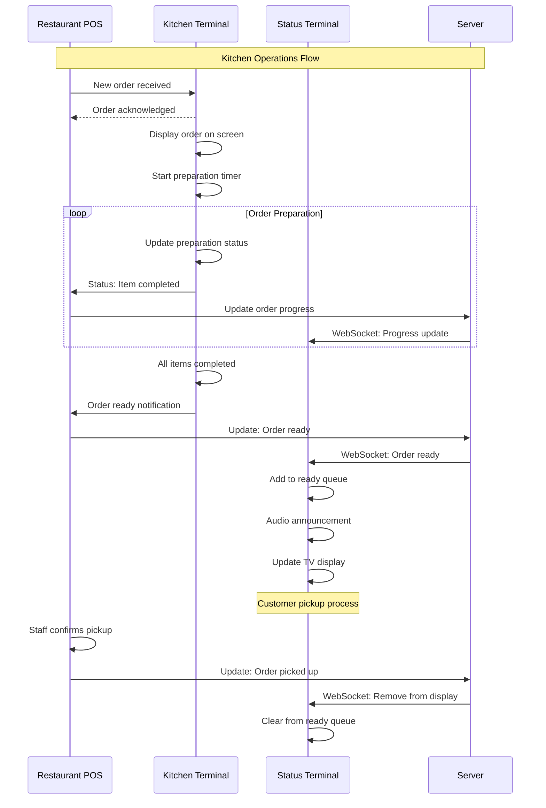
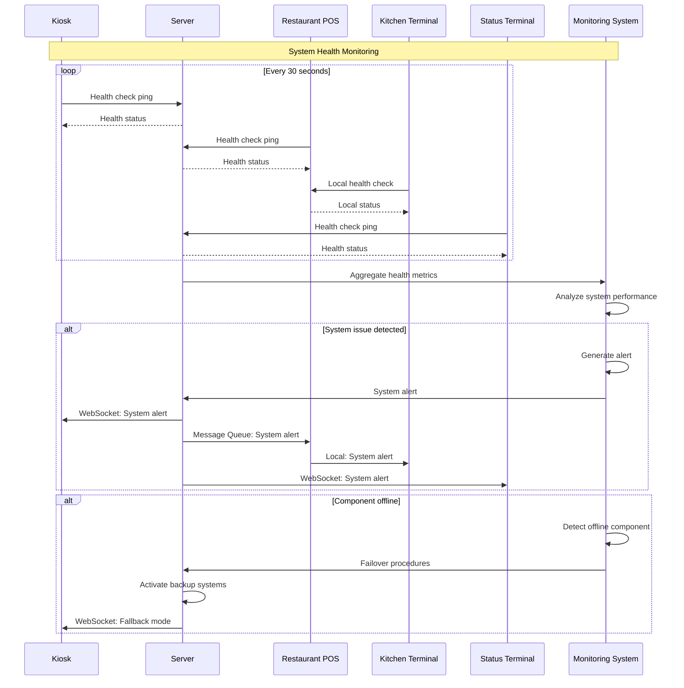

# Multi-Restaurant Kiosk System Architecture & Message Flow

## System Overview Diagram



-----

## System Components Architecture

### 1. Ordering Kiosk Architecture

```mermaid
graph TD
    subgraph "Kiosk Hardware"
        TOUCH[24" Touchscreen Display]
        CPU[Intel i7 Processor]
        MEM[16GB RAM + 512GB SSD]
        QR[QR Code Scanner]
        PRINTER[Receipt Printer]
        SPEAKER[Audio Speaker]
        CAMERA[Security Camera]
    end
    
    subgraph "Kiosk Software Stack"
        UI[React Native UI]
        APP[Kiosk Application]
        CACHE[Local Cache]
        SYNC[Data Sync Service]
        PAYMENT[Payment Module]
        OFFLINE[Offline Mode]
    end
    
    subgraph "Connectivity"
        WIFI[WiFi 6]
        LTE[4G LTE Backup]
        ETH[Ethernet]
    end
    
    TOUCH --> UI
    CPU --> APP
    MEM --> CACHE
    QR --> PAYMENT
    PRINTER --> APP
    SPEAKER --> UI
    CAMERA --> APP
    
    APP --> SYNC
    SYNC --> WIFI
    SYNC --> LTE
    SYNC --> ETH
    
    CACHE --> OFFLINE
    PAYMENT --> OFFLINE
```

### 2. Central Server Infrastructure



### 3. Restaurant POS Terminal

```mermaid
graph TD
    subgraph "POS Hardware"
        DISPLAY[15.6" Touch Display]
        ARM[ARM Processor]
        STORAGE[8GB RAM + 128GB Storage]
        THERMAL[Thermal Printer]
        CASH[Cash Drawer]
        SCANNER[Barcode Scanner]
    end
    
    subgraph "POS Software"
        POS_UI[POS Interface]
        ORDER_MGT[Order Management]
        INVENTORY_MGT[Inventory Management]
        SALES_RPT[Sales Reporting]
        PAYMENT_INT[Payment Integration]
        BIR_COMP[BIR Compliance]
    end
    
    subgraph "Connectivity"
        WIFI_POS[WiFi Connection]
        CLOUD_SYNC[Cloud Synchronization]
        LOCAL_DB[Local Database]
    end
    
    DISPLAY --> POS_UI
    ARM --> ORDER_MGT
    STORAGE --> LOCAL_DB
    THERMAL --> SALES_RPT
    CASH --> PAYMENT_INT
    SCANNER --> INVENTORY_MGT
    
    POS_UI --> ORDER_MGT
    ORDER_MGT --> CLOUD_SYNC
    CLOUD_SYNC --> WIFI_POS
    LOCAL_DB --> BIR_COMP
```

### 4. Kitchen Terminal System



### 5. Order Status Terminal & TV Display

```mermaid
graph TD
    subgraph "Status Display Hardware"
        TV_SCREEN[Large TV Screen 55"+]
        MEDIA_PLAYER[Media Player/Raspberry Pi]
        SPEAKERS[Audio Speakers]
        LED_LIGHTS[LED Status Lights]
    end
    
    subgraph "Display Software"
        STATUS_APP[Status Display App]
        QUEUE_DISPLAY[Queue Display]
        ANIMATIONS[Transition Animations]
        MULTI_LANG[Multi-language Support]
        BRANDING[Restaurant Branding]
    end
    
    subgraph "Data Management"
        STATUS_SYNC[Status Synchronization]
        CACHE_STATUS[Status Cache]
        UPDATE_ENGINE[Update Engine]
    end
    
    TV_SCREEN --> STATUS_APP
    MEDIA_PLAYER --> QUEUE_DISPLAY
    SPEAKERS --> ANIMATIONS
    LED_LIGHTS --> STATUS_APP
    
    STATUS_APP --> STATUS_SYNC
    QUEUE_DISPLAY --> CACHE_STATUS
    STATUS_SYNC --> UPDATE_ENGINE
```

-----

## Interface Specifications

### 1. Kiosk to Server Interface

```typescript
// REST API Endpoints
interface KioskServerAPI {
  // Menu Management
  getRestaurants(): Promise<Restaurant[]>;
  getMenuItems(restaurantId: string): Promise<MenuItem[]>;
  checkItemAvailability(itemId: string): Promise<boolean>;
  
  // Order Management
  createOrder(orderData: OrderRequest): Promise<OrderResponse>;
  updateOrder(orderId: string, updates: OrderUpdate): Promise<void>;
  getOrderStatus(orderId: string): Promise<OrderStatus>;
  
  // Payment Processing
  initiatePayment(paymentData: PaymentRequest): Promise<PaymentResponse>;
  verifyPayment(transactionId: string): Promise<PaymentStatus>;
  
  // System Health
  healthCheck(): Promise<SystemStatus>;
  syncData(): Promise<SyncResponse>;
}

// WebSocket Events
interface KioskWebSocketEvents {
  onOrderStatusUpdate: (orderId: string, status: OrderStatus) => void;
  onMenuUpdate: (restaurantId: string, menu: MenuItem[]) => void;
  onSystemAlert: (alert: SystemAlert) => void;
  onPaymentCallback: (transactionId: string, status: PaymentStatus) => void;
}
```

### 2. Server to Restaurant POS Interface

```typescript
// Message Queue Interface
interface ServerToPOSInterface {
  // Order Events
  onNewOrder: {
    topic: "orders.new";
    payload: {
      orderId: string;
      restaurantId: string;
      items: OrderItem[];
      customerInfo: CustomerInfo;
      totalAmount: number;
      paymentStatus: PaymentStatus;
      timestamp: string;
    };
  };
  
  onOrderUpdate: {
    topic: "orders.update";
    payload: {
      orderId: string;
      status: OrderStatus;
      estimatedTime: number;
      notes: string;
    };
  };
  
  onOrderCancellation: {
    topic: "orders.cancel";
    payload: {
      orderId: string;
      reason: string;
      refundAmount: number;
    };
  };
}

// POS Response Interface
interface POSToServerInterface {
  // Order Acknowledgment
  acknowledgeOrder: {
    topic: "orders.acknowledge";
    payload: {
      orderId: string;
      acknowledged: boolean;
      estimatedPrepTime: number;
      issues?: string[];
    };
  };
  
  // Status Updates
  updateOrderStatus: {
    topic: "orders.status";
    payload: {
      orderId: string;
      status: "received" | "preparing" | "ready" | "completed";
      timestamp: string;
    };
  };
  
  // Inventory Updates
  updateInventory: {
    topic: "inventory.update";
    payload: {
      itemId: string;
      quantity: number;
      available: boolean;
    };
  };
}
```

### 3. POS to Kitchen Terminal Interface

```typescript
// Local Network Interface
interface POSToKitchenInterface {
  // Order Dispatch
  sendToKitchen: {
    orderId: string;
    items: KitchenItem[];
    priority: "normal" | "urgent";
    specialInstructions: string;
    customerInfo: {
      orderNumber: string;
      customerName?: string;
    };
  };
  
  // Kitchen Feedback
  receiveFromKitchen: {
    orderId: string;
    status: "started" | "in-progress" | "ready";
    estimatedCompletion: string;
    completedItems: string[];
  };
}

// Kitchen Display Protocol
interface KitchenDisplayProtocol {
  displayOrder: {
    orderNumber: string;
    items: DisplayItem[];
    timestamp: string;
    priority: number;
    customerType: "dine-in" | "takeout" | "delivery";
  };
  
  updateTimer: {
    orderNumber: string;
    elapsedTime: number;
    targetTime: number;
    status: "on-time" | "delayed" | "urgent";
  };
}
```

### 4. Kitchen to Status Display Interface

```typescript
// Status Broadcasting Interface
interface KitchenToStatusInterface {
  // Order Ready Notification
  orderReady: {
    orderNumber: string;
    customerInfo: CustomerDisplayInfo;
    readyTime: string;
    pickupLocation: string;
    announcement: {
      text: string;
      audio: boolean;
      language: "en" | "tl" | "zh";
    };
  };
  
  // Queue Updates
  queueUpdate: {
    restaurant: string;
    currentOrders: QueueItem[];
    averageWaitTime: number;
    nextOrderTime: string;
  };
}

// TV Display Protocol
interface TVDisplayProtocol {
  displayQueue: {
    readyOrders: ReadyOrder[];
    preparingOrders: PreparingOrder[];
    waitTimes: WaitTimeInfo[];
    announcements: Announcement[];
  };
  
  styling: {
    theme: "light" | "dark" | "brand";
    language: string;
    fontSize: "small" | "medium" | "large";
    animations: boolean;
  };
}
```

-----

## Message Flow Diagrams

### 1. Complete Order Flow



### 2. Payment Processing Flow



### 3. Kitchen Operation Flow



### 4. System Health Monitoring Flow



-----

## Data Models & Protocols

### Core Data Structures

```typescript
// Order Data Model
interface Order {
  orderId: string;
  orderNumber: string;
  restaurantId: string;
  customerId?: string;
  items: OrderItem[];
  totalAmount: number;
  taxAmount: number;
  discountAmount: number;
  paymentMethod: "gcash" | "maya" | "card" | "cash";
  paymentStatus: "pending" | "completed" | "failed" | "refunded";
  orderStatus: "received" | "preparing" | "ready" | "completed" | "cancelled";
  timestamps: {
    created: string;
    paid: string;
    acknowledged: string;
    preparing: string;
    ready: string;
    completed: string;
  };
  estimatedPrepTime: number;
  actualPrepTime?: number;
  specialInstructions?: string;
  customerInfo: CustomerInfo;
}

// Menu Item Model
interface MenuItem {
  itemId: string;
  restaurantId: string;
  name: string;
  description: string;
  price: number;
  category: string;
  subcategory?: string;
  image: string;
  ingredients: string[];
  allergens: string[];
  nutritionInfo?: NutritionInfo;
  available: boolean;
  preparationTime: number;
  spicyLevel?: number;
  customizations: Customization[];
  tags: string[];
}

// Restaurant Model
interface Restaurant {
  restaurantId: string;
  name: string;
  cuisine: string;
  description: string;
  logo: string;
  coverImage: string;
  status: "open" | "closed" | "busy";
  operatingHours: OperatingHours;
  averagePrepTime: number;
  rating: number;
  location: string;
  contact: ContactInfo;
  paymentMethods: PaymentMethod[];
  menu: MenuItem[];
  settings: RestaurantSettings;
}
```

### Communication Protocols

```yaml
# WebSocket Protocol Specification
websocket_protocol:
  connection: "wss://api.nteksystems.ph/ws"
  authentication: "Bearer JWT Token"
  heartbeat_interval: 30_seconds
  
  channels:
    - name: "orders"
      events: ["new", "update", "status", "cancel"]
    - name: "payments"
      events: ["success", "failure", "timeout"]
    - name: "system"
      events: ["health", "alert", "maintenance"]
    - name: "menu"
      events: ["update", "availability"]

# Message Queue Protocol
message_queue_protocol:
  broker: "RabbitMQ"
  exchange_type: "topic"
  
  exchanges:
    orders:
      routing_keys:
        - "orders.new.{restaurant_id}"
        - "orders.update.{restaurant_id}"
        - "orders.cancel.{restaurant_id}"
    
    payments:
      routing_keys:
        - "payments.success.{order_id}"
        - "payments.failure.{order_id}"
    
    notifications:
      routing_keys:
        - "notify.order.{customer_id}"
        - "notify.system.{location_id}"

# REST API Protocol
rest_api_protocol:
  base_url: "https://api.nteksystems.ph/v1"
  authentication: "Bearer JWT Token"
  rate_limiting: "1000 requests/minute"
  
  content_type: "application/json"
  error_format: "RFC 7807 Problem Details"
  
  standard_headers:
    - "X-Request-ID"
    - "X-Client-Version"
    - "X-Location-ID"
    - "Accept-Language"
```

This comprehensive system architecture provides a robust, scalable, and maintainable foundation for the multi-restaurant kiosk system, ensuring reliable communication between all components while maintaining high performance and fault tolerance.